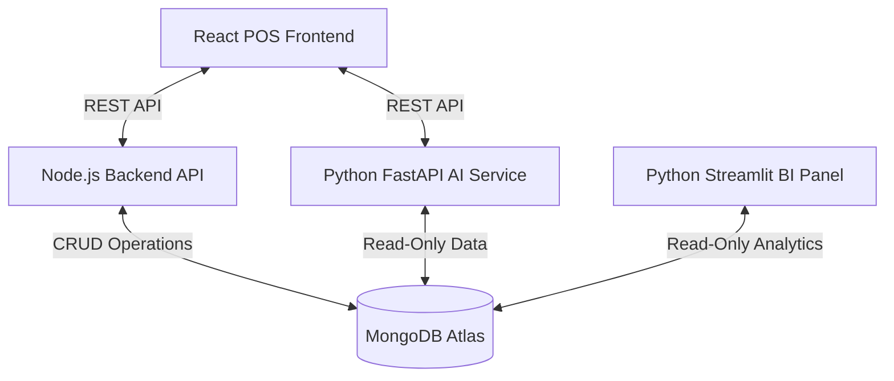
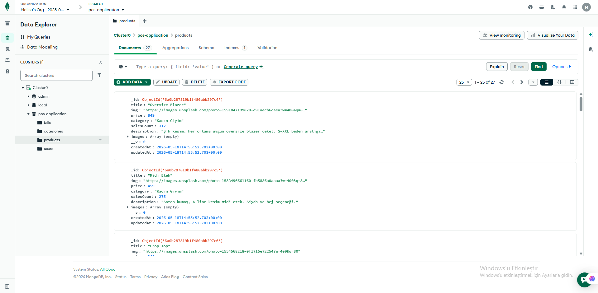
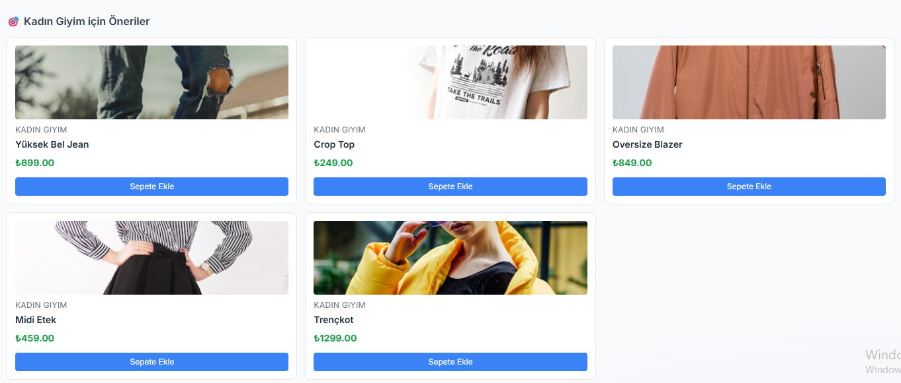
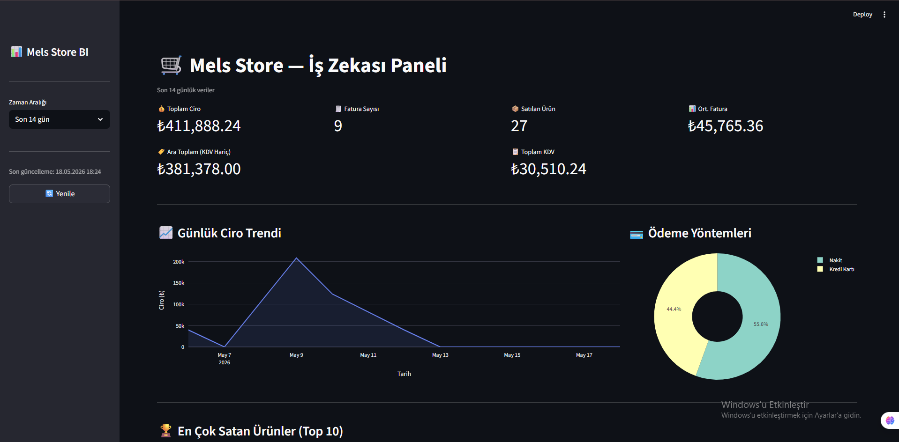

# Mels Store - Next Generation E-Commerce POS System

## About The Project

**Mels Store** is a comprehensive, intelligent Point of Sale (POS) and E-Commerce management ecosystem. Moving beyond traditional cashier registers, it integrates modern web technologies with Artificial Intelligence (AI) and Business Intelligence (BI) tools to provide a seamless experience for both staff and management.

### Core Features
- **Modern User Interface:** Built with React and Tailwind CSS, featuring a beautiful glassmorphism design and dynamic Light/Dark mode toggling.
- **Role-Based Access Control (RBAC):** Secure authentication system separating `Superadmin` (full access to inventory, analytics, and billing) and `Cashier` (limited to cart management and checkout).
- **AI Recommendation Engine:** A Python FastAPI backend that analyzes cart contents and suggests complementary products in real-time ("Customers who bought this also bought...").
- **Business Intelligence Dashboard:** A dedicated Python Streamlit panel for business owners to visualize daily revenue, popular items, and payment methods using interactive Plotly charts.
- **Firebase Event Tracking:** Anonymous tracking of user behaviors (page views, cart additions, purchases) to analyze application usage.

---

## System Architecture

Mels Store is built on a modular microservices architecture, consisting of four main components connected to a centralized MongoDB database.



---

## Components Overview

### 1. POS Client (`pos-application/client`)
- **Technology Stack**: React, Redux, Ant Design, Tailwind CSS.
- **Role**: The main user interface where cashiers take orders, manage the cart, and process payments. Features responsive design and real-time UI updates.


### 2. Node.js Backend (`pos-application/api`)
- **Technology Stack**: Node.js, Express.js, Mongoose, JWT.
- **Role**: Handles secure user authentication, product management, and invoice (bill) generation. It is the primary service with write-access to the database.



### 3. AI Service (`ai-service`)
- **Technology Stack**: Python, FastAPI, Motor (Async MongoDB).
- **Role**: Analyzes the database to generate real-time product recommendations (cross-selling) based on the current items in the user's cart.



### 4. BI Dashboard (`bi-dashboard`)
- **Technology Stack**: Python, Streamlit, Pandas, Plotly.
- **Role**: A standalone reporting dashboard for management to track business performance, monitor revenue trends, and identify top-selling products through interactive charts.



---

## Local Setup & Installation

The project is designed to run locally (`localhost`) as a fully functional ecosystem.

### Prerequisites
- Node.js (v16+)
- Python (v3.9+)
- MongoDB Atlas Account (or Local MongoDB Server)

### Step-by-Step Execution Guide

1. **Database Configuration:**
   Ensure that you create a `.env` file in **all** backend/service folders (`pos-application/api`, `ai-service`, `bi-dashboard`) and set your MongoDB connection string:
   ```env
   MONGO_URI=mongodb+srv://<username>:<password>@cluster.mongodb.net/pos-application
   ```

2. **Run Node.js Backend API:**
   ```bash
   cd pos-application/api
   npm install
   node server.js
   # Runs on http://localhost:5000
   ```

3. **Run React POS Frontend:**
   ```bash
   cd pos-application/client
   npm install
   npm start
   # Runs on http://localhost:3000
   ```

4. **Run Python AI Service:**
   ```bash
   cd ai-service
   pip install -r requirements.txt
   npm run dev  # or use: uvicorn main:app --reload --port 8000
   # Runs on http://localhost:8000
   ```

5. **Run Streamlit BI Dashboard:**
   ```bash
   cd bi-dashboard
   pip install -r requirements.txt
   streamlit run dashboard.py
   # Runs on http://localhost:8501
   ```

---

## Load Testing

To measure the system's resilience under stress, `k6` load testing tool is utilized. To run the script located in the `stress-tests` directory:
```bash
k6 run load_test.js
```
*Note: Make sure to specify the target API URLs using environment variables within the script before running.*
