# Mels Store: Intelligent E-Commerce Ecosystem Developed Using MERN Stack and Event-Driven Data Analytics

**GitHub Repository:** https://github.com/melisamehe/GraduationThesis

---

## 1. Introduction
Today, the retail and e-commerce sectors heavily rely on Point of Sale (POS) systems through which businesses manage their sales. However, traditional POS systems generally only serve the function of recording transactions and fall short in terms of user experience and data analytics. **Mels Store**, developed in this graduation thesis, is a next-generation e-commerce POS system that combines modern web technologies (React, Node.js) with artificial intelligence (FastAPI-based product recommendation engine) and business intelligence (Streamlit BI Dashboard) tools. The main objective of the project is to maximize the cashier/manager experience with a modern interface while providing business owners with AI-supported insights based on sales data.

## 2. Related Work
In the literature and the market, there are many commercial POS systems such as Shopify POS, Square, and Lightspeed. Although these systems have robust payment infrastructures, they offer data analytics and AI recommendation systems as add-on modules (usually at high costs). In academic studies, POS systems are generally examined based on transaction speed and database optimizations. Mels Store distinguishes itself from existing studies by integrating machine learning-based recommendation systems and a Business Intelligence (BI) dashboard into its core architecture, aiming to provide small and medium-sized enterprises (SMEs) with free access to enterprise-level data analytics.

## 3. Method
The project was developed with a modular approach similar to a microservices architecture. The architecture consists of three main components:

1. **Main POS Application (MERN Stack):** 
   - **Frontend:** A user interface developed using React.js, Tailwind CSS, and Ant Design. It features dynamic Light/Dark mode support and a glassmorphism design.
   - **Backend:** A RESTful API developed using Node.js and Express.js. It communicates with the MongoDB database to provide product, category, user, and bill management.
2. **AI Service (Artificial Intelligence Service):** 
   - Developed using Python and FastAPI. It connects to MongoDB asynchronously (Motor). It generates real-time product recommendations based on the products in the cart and sales trends.
3. **BI Dashboard (Business Intelligence Panel):** 
   - Developed using Python and Streamlit. It analyzes sales data (revenue, tax, average cart value) and generates interactive charts (pie charts, bar charts, etc.) using the Plotly library.

```text
       [React.js Frontend]
          │          │
          │          └──(Fetch Recommendations)──▶ [FastAPI AI Service]
          │                                                │
      (REST API)                                      (Read Data)
          │                                                │
          ▼                                                ▼
   [Node.js Backend] ──(CRUD Operations)─────────▶ [(MongoDB Atlas)]
                                                           ▲
                                                           │
   [Streamlit BI Dashboard] ──(Read Analytics)─────────────┘
```

## 4. Implementation
This section presents code snippets and interface images from critical points of the project.

### 4.1. Dynamic Theme Management (Dark/Light Mode)
As an important part of a modern user experience, a global theme management system was implemented using Tailwind CSS variables.

**Screenshot Placeholder:** 
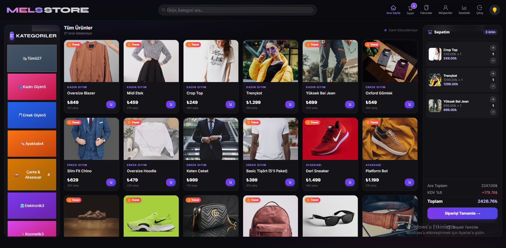
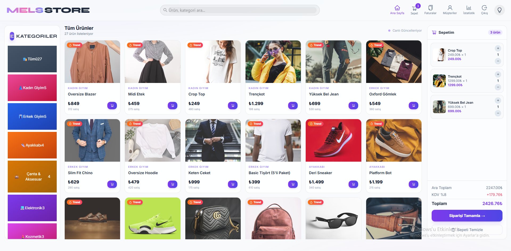

**Code Snippet: ThemeToggle.jsx**
```javascript
export const ThemeToggle = () => {
  const [theme, setTheme] = useState(localStorage.getItem("theme") || "light");

  useEffect(() => {
    if (theme === "dark") {
      document.documentElement.classList.add("dark");
    } else {
      document.documentElement.classList.remove("dark");
    }
    localStorage.setItem("theme", theme);
  }, [theme]);

  const toggleTheme = () => setTheme(theme === "light" ? "dark" : "light");

  return (
    <button onClick={toggleTheme} className="theme-toggle-btn">
      {theme === "light" ? <MoonOutlined /> : <BulbOutlined />}
    </button>
  );
};
```

### 4.2. Artificial Intelligence Recommendation Engine (AI Service)
The service running on FastAPI performs dynamic analysis based on the category of the products in the cart, similar to "Customers who bought this item also bought".

**Screenshot Placeholder:** 
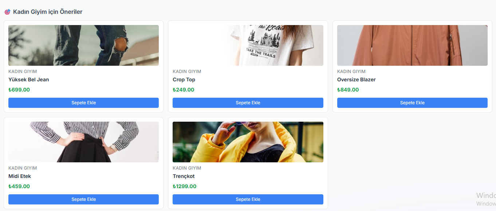

**Code Snippet: FastAPI Recommendation Logic**
```python
@app.post("/recommendations/cart")
async def get_cart_recommendations(request: CartRecommendationRequest):
    """Generates complementary recommendations based on products in the cart."""
    category_counts = Counter(item.category for item in request.cart_items)
    dominant_category = category_counts.most_common(1)[0][0]
    
    # Fetch top sellers based on category (excluding their own IDs)
    cursor = db.products.find({"category": dominant_category}).sort("salesCount", -1).limit(4)
    recommendations = []
    async for product in cursor:
        product["_id"] = str(product["_id"])
        recommendations.append(product)
        
    return {"recommendations": recommendations}
```

### 4.3. Firebase Event Tracking (Analytics)
Google Firebase Analytics was integrated into the system to anonymously track user behavior within the application (product views, adding to cart, purchasing) and perform cross-analysis with BI Dashboard data.
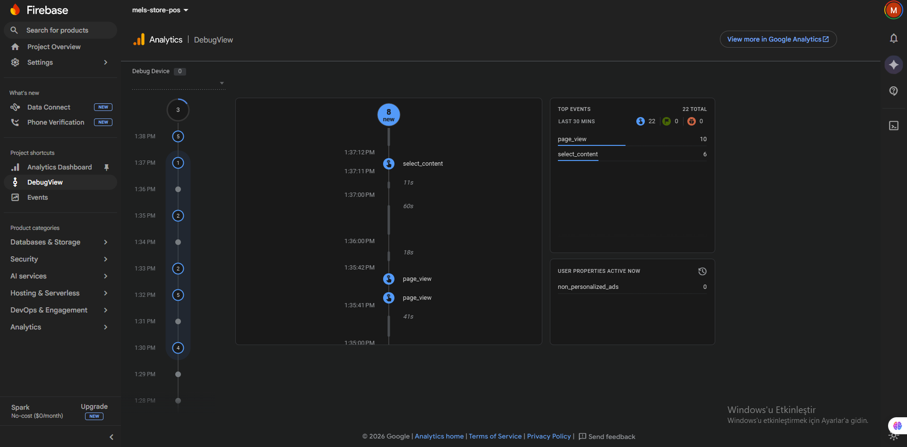
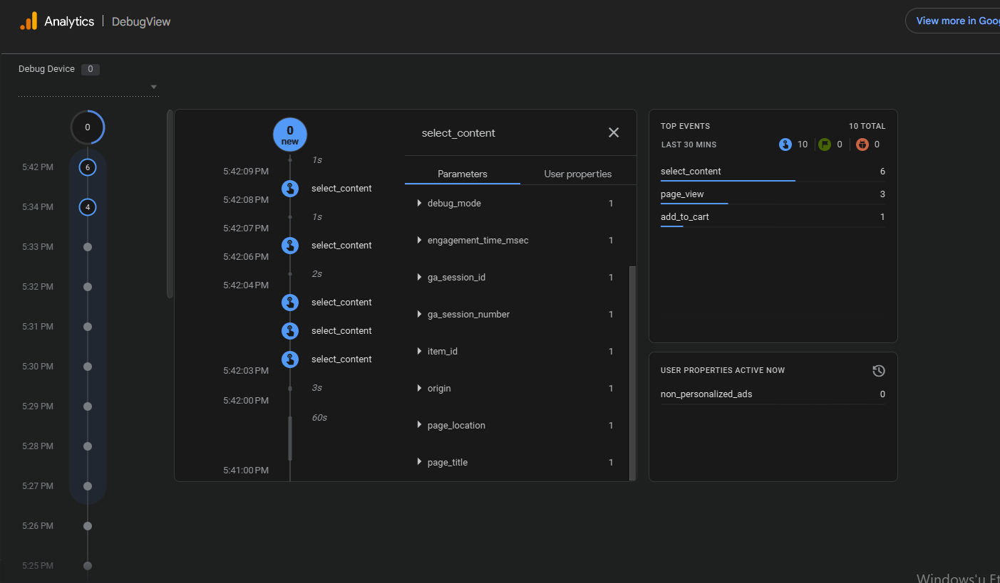

**Code Snippet: firebase.js (Sample Purchase Logging Function)**
```javascript
import { initializeApp } from "firebase/app";
import { getAnalytics, logEvent } from "firebase/analytics";

const app = initializeApp(firebaseConfig);
export const analytics = getAnalytics(app);

export const trackPurchase = (billId, totalAmount, cartItems) => {
  logEvent(analytics, "purchase", {
    transaction_id: billId,
    value: totalAmount,
    currency: "TRY",
    items: cartItems.map((item) => ({
      item_id: item._id,
      item_name: item.title,
      item_category: item.category,
      price: item.price,
      quantity: item.quantity,
    })),
  });
};
```

### 4.4. Business Intelligence (BI Dashboard) Analytics Panel
Developed for managers to visualize data in addition to the cashier application. Live data is fetched from the invoice (bills) collection on MongoDB using Python Pandas and Plotly libraries.

**Code Snippet: Streamlit Data Visualization (dashboard.py)**
```python
# Daily Revenue Trend Chart
st.subheader("📈 Daily Revenue Trend")
daily = (bills_summary.groupby(bills_summary["date"].dt.date)["total_amount"]
         .sum().reset_index())
daily.columns = ["Date", "Revenue (₺)"]
fig = px.area(daily, x="Date", y="Revenue (₺)",
              color_discrete_sequence=["#667eea"], template="plotly_white")
fig.update_traces(fill="tozeroy")
st.plotly_chart(fig, use_container_width=True)
```

**Screenshot Placeholder:** 
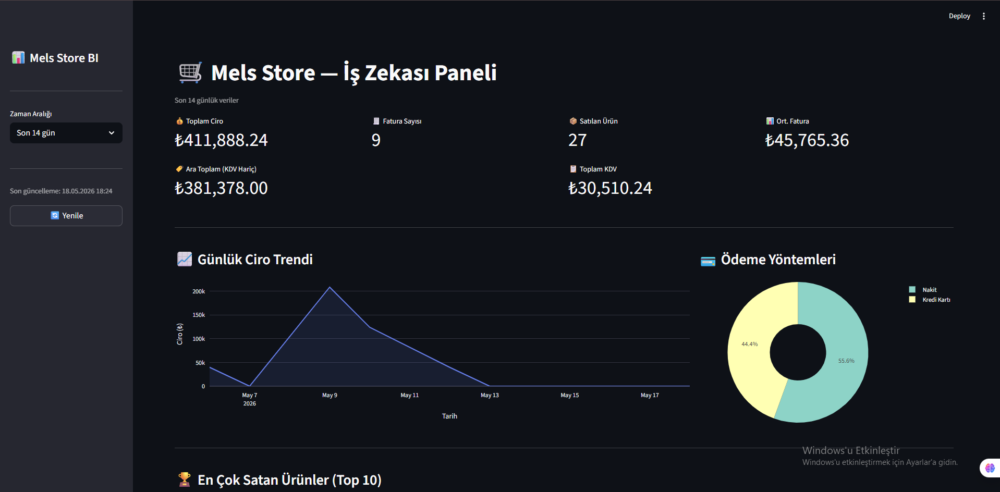
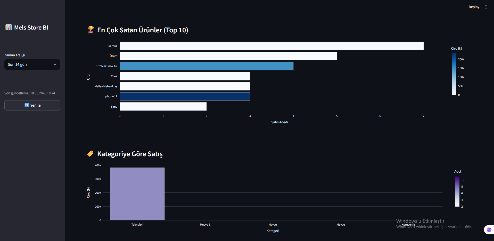
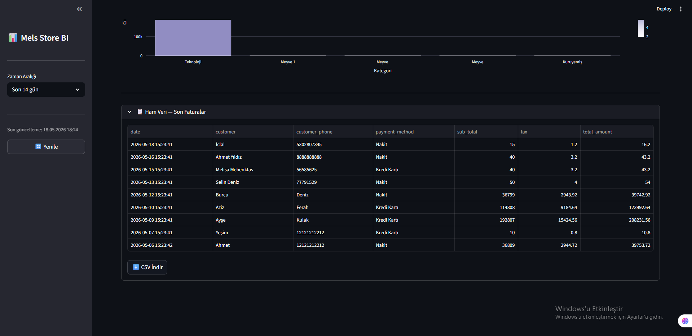

### 4.5. Role-Based Access Control (RBAC)
To protect data security and permission boundaries within the system, two different role types (Role-Based Access Control) were designed: Superadmin and User (Cashier). Thanks to the middleware structure created on Express.js, sensitive operations such as adding products or categories, deleting invoices, and accessing detailed analytics pages can only be performed by users with the `superadmin` role.
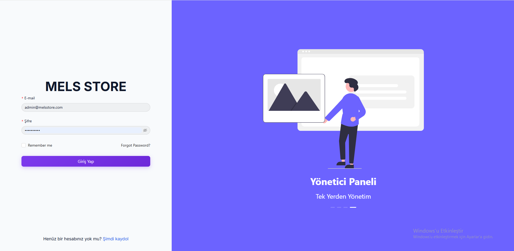
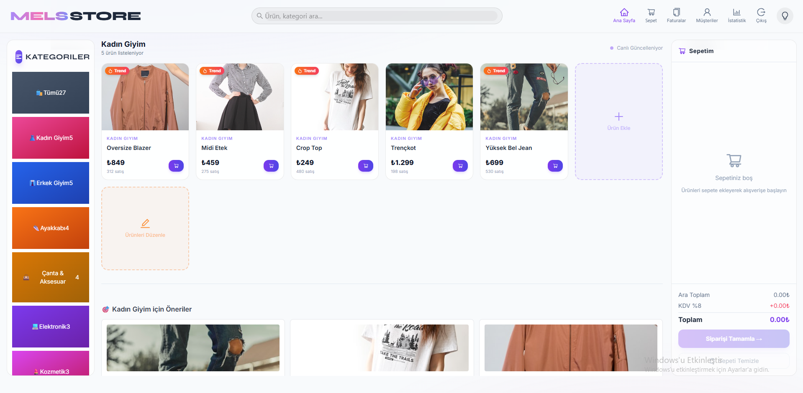
Below, the permissions of a user in the User (Cashier) role are shown. They can only add products to the cart and create orders.
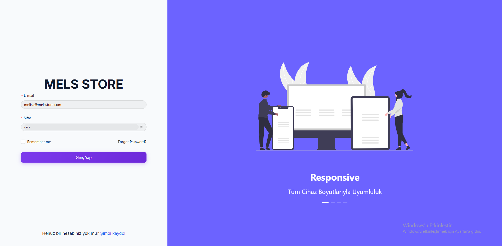
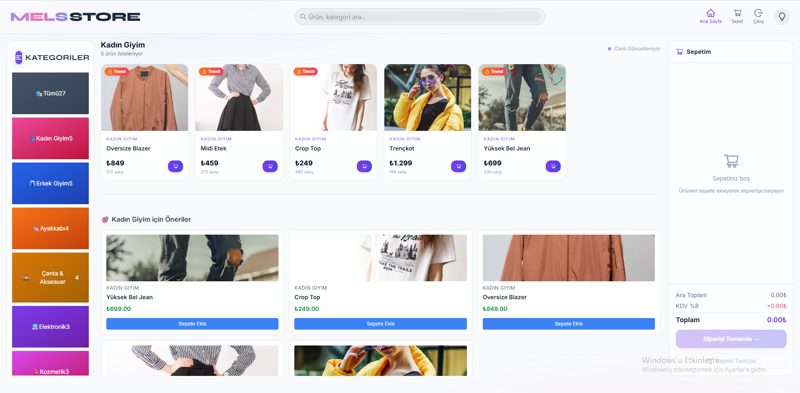

**Code Snippet: Node.js Admin Middleware (requireAdmin.js)**
```javascript
const verifyToken = require("./verifyToken");

const requireAdmin = (req, res, next) => {
  verifyToken(req, res, () => {
    // The role in the user information decoded from the JWT is checked
    if (req.user && req.user.role === "superadmin") {
      next(); // Continue processing if authorized
    } else {
      return res.status(403).json({ message: "Administrator permission is required for this operation." });
    }
  });
};

module.exports = requireAdmin;
```

On the frontend side, Admin tabs (Bills, Customers, Statistics, Add Product, etc.) in the menu are dynamically hidden according to the user's authorization.

## 5. Results
The developed system was successfully tested. 
- Sub-second page transitions and cart operations (Ant Design Popconfirm etc.) were achieved thanks to the MERN architecture.
- Dark and light theme transitions were integrated into the system using global CSS variables (Glassmorphism).
- Thanks to Firebase integration, user events (page_view, add_to_cart, purchase) are successfully logged into the analytics panel.
- The Artificial Intelligence service and BI Dashboard work in harmony with MongoDB Atlas, seamlessly visualizing both old and new invoices.

## 6. Limitation
The system currently has some limitations:
- **Payment Gateway:** The system can issue invoices and record the payment method, but a real credit card processing integration (Virtual POS) such as Iyzico or Stripe has not been added yet.
- **Artificial Intelligence Model:** The current recommendation engine operates with the "Category-Based Top Sellers" heuristic. Collaborative Filtering based on Deep Learning is not yet active.

## 7. Future Work
The following improvements are planned for future studies:
- Integration of an advanced AI algorithm that trains a machine learning model based on user purchase history (e.g., Matrix Factorization).
- Enabling real-time payments directly from within the application via Stripe API integration.

## 8. Conclusion
In this thesis study, a comprehensive e-commerce management tool (Mels Store) incorporating modern interface design, business intelligence, and artificial intelligence recommendation systems was developed, stepping outside the traditional POS concept that solely focuses on making sales. The application's modern web architecture ensures that the system can be easily expanded with new modules in the future.

---
*Note: The content of this report was prepared considering the technical architecture of the developed application. Screenshots taken from the working application should be added to the sections with image placeholders.*
